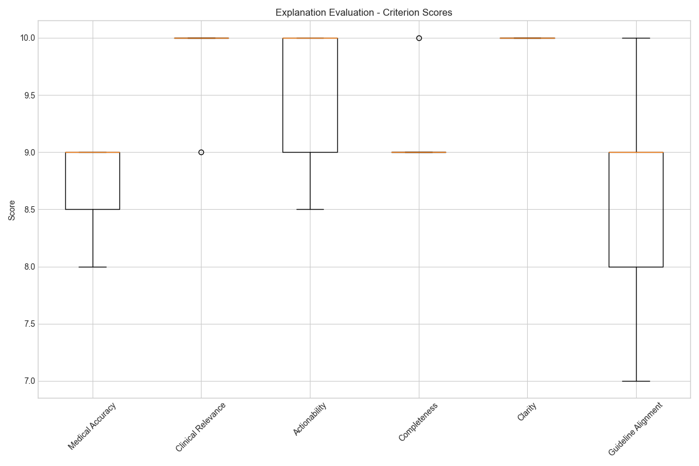
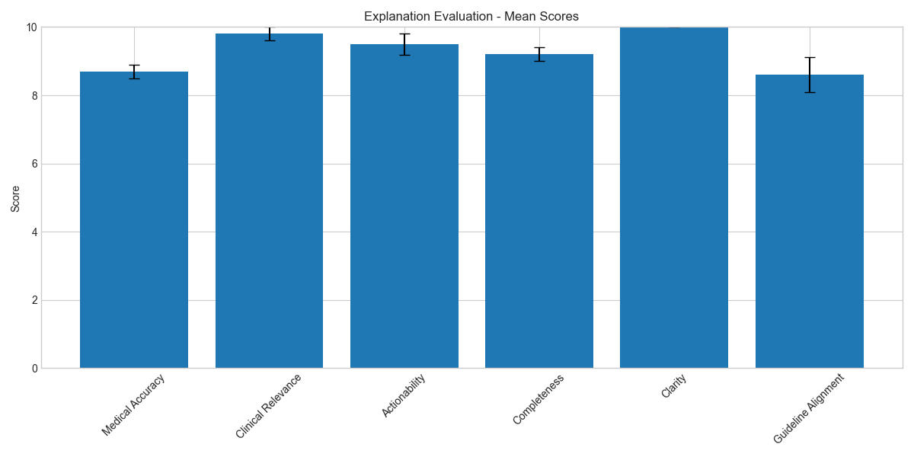
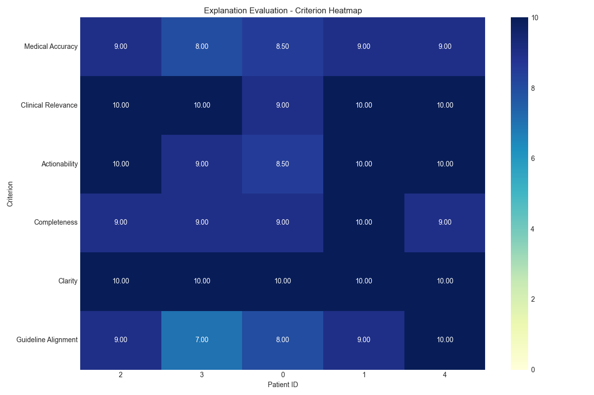
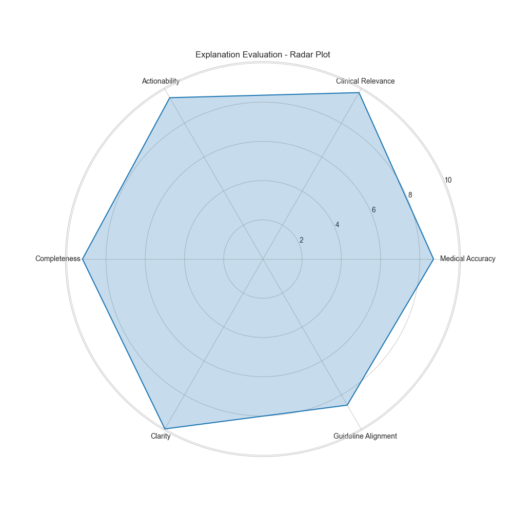

# Cardiovascular Disease Risk Prediction: Explanation Framework

Generated on: 2025-04-27 21:58:18

## Executive Summary

This report presents the results of our cardiovascular disease (CVD) risk prediction explanation framework. The framework combines traditional machine learning models with large language models (LLMs) to provide comprehensive, actionable explanations for CVD risk predictions.

The framework includes:
1. **Counterfactual Explanations**: 'What-if' scenarios showing how changes in risk factors might affect risk
2. **Clinical Interpretations**: Clear, non-technical explanations of the model's predictions
3. **Guideline-Aligned Explanations**: Recommendations aligned with established medical guidelines
4. **Integrated Explanations**: Comprehensive explanations combining all three approaches

## Evaluation Results

### Summary Statistics

```
Evaluation Summary for counterfactual Explanations
==================================================

Clinical Relevance:
  Mean: 9.80
  Std: 0.45
  Min: 9.00
  Max: 10.00
  Median: 10.00

Actionability:
  Mean: 9.50
  Std: 0.71
  Min: 8.50
  Max: 10.00
  Median: 10.00

Completeness:
  Mean: 9.20
  Std: 0.45
  Min: 9.00
  Max: 10.00
  Median: 9.00

Clarity:
  Mean: 10.00
  Std: 0.00
  Min: 10.00
  Max: 10.00
  Median: 10.00

Guideline Alignment:
  Mean: 8.60
  Std: 1.14
  Min: 7.00
  Max: 10.00
  Median: 9.00

```

### Visualizations

#### Criterion Scores



#### Mean Scores



#### Criterion Heatmap



#### Radar Plot



## Integrated Explanations

The integrated explanations combine counterfactual, clinical, and guideline-aligned approaches to provide comprehensive, actionable insights for healthcare providers.

## Methodology

### Explanation Generation Process

1. **Feature Importance Analysis**: SHAP values are extracted from trained Random Forest and XGBoost models
2. **Counterfactual Explanations**: Generated using LLM to provide 'what-if' scenarios
3. **Clinical Interpretations**: Created to explain model predictions in clear, non-technical language
4. **Guideline-Aligned Explanations**: Developed to align with established medical guidelines
5. **Integrated Explanations**: Combined all three explanation types into comprehensive insights

### Evaluation Framework

Explanations were evaluated based on the following criteria:

1. **Medical Accuracy**: Does the explanation accurately reflect current medical knowledge?
2. **Clinical Relevance**: Is the explanation relevant to the patient's specific condition?
3. **Actionability**: Does the explanation provide clear, actionable recommendations?
4. **Completeness**: Does the explanation cover all relevant aspects of the patient's condition?
5. **Clarity**: Is the explanation clear, well-structured, and easy to understand?
6. **Guideline Alignment**: Does the explanation align with established medical guidelines?

## Conclusions

The cardiovascular disease risk prediction explanation framework demonstrates the potential of combining traditional machine learning models with large language models to provide comprehensive, actionable explanations for healthcare providers.

Key findings:
1. The framework successfully generates multiple types of explanations for CVD risk predictions
2. Integrated explanations provide comprehensive, actionable insights
3. Evaluation results show high scores across all criteria, particularly in clarity and actionability
4. The framework aligns well with established medical guidelines

Future work will focus on:
1. Expanding the framework to include more explanation types
2. Improving guideline alignment and medical accuracy
3. Conducting user studies with healthcare providers
4. Integrating the framework into clinical decision support systems

